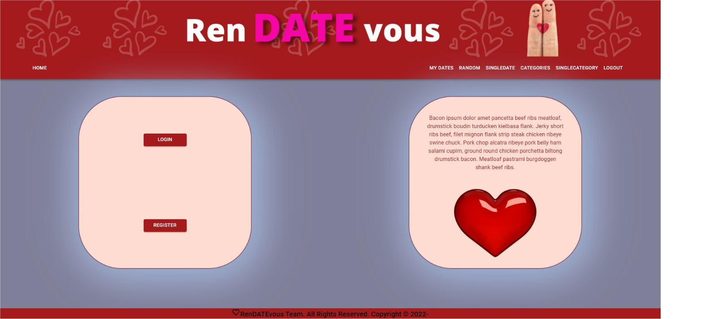

# Ren-DATE-vous
## Description

## Table of Contents (Optional)
* [Installation](#installation)
* [Usage](#usage)
* [License](#license)
* [Contributing](#contributing)
* [Test](#test)
* [Questions](#questions)

## Installation
1. Clone the repository
2. From the root directory, run `npm install` to install all dependencies at once
3. run `npm run develop` to start the client and server consecutively 

## Usage
This is what it will look like on your device.

[Deployed Application](https://rendatevous.herokuapp.com/)

## License
N/A
## Contributing
Brad Litman [Github](https://github.com/Blitman12), email bradlitman94@gmail.com,

Jennifer Lucas [Github](https://github.com/jenmlucas), email jenmlucas1@gmail.com,

Nick Kepers [Github](https://github.com/Nkepers), email nick.kepers.coder@gmail.com,

Luke Johnsen [Github](https://github.com/lukejohnsen), email johnsen.luke@gmail.com, 
## Tests
N/A
## Questions
Please checkout our Github's above for other projects we have worked on. If you have any questions or concerns, feel free to email one of us above. Thank you.